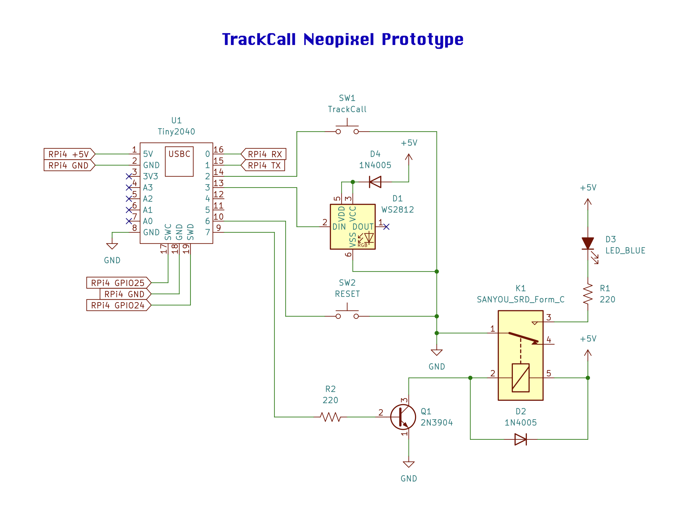

# TrackCall NeoPixel


A track-call limiter for slot car racing, built on the RP2040-based Pimoroni Tiny 2040 using the Raspberry Pi Pico C/C++ SDK. When a car comes off the track, the driver needs the track de-energized to safely reset it — TrackCall gives each player exactly 3 of these calls per race, then locks them out.

This is a variant of the original [TrackCall](https://github.com/olael94/TrackCall), replacing the three discrete LEDs with a single addressable WS2812 (NeoPixel) LED.

## Demo

https://github.com/user-attachments/assets/5174604c-2c72-4426-af35-1a0e1bb4af9d

## How It Works

Pressing the **Track Call** button de-energizes the track for one second (so the player can put their car back on) and changes the NeoPixel's color to show how many calls have been used. Once the 3rd call is used, the track can no longer be de-energized — pressing the button again just flashes the NeoPixel cyan then purple to tell the player they're out of chances. The **Reset** button clears the call count back to zero for the next race/heat.

| Call # | NeoPixel Color | Track Power (Relay) |
|:---:|:---:|:---:|
| 0 (ready) | Green | energized |
| 1st call | Yellow | de-energized for 1s |
| 2nd call | Red | de-energized for 1s |
| 3rd call | Off | de-energized for 1s |
| 4th+ attempt | flashes cyan then purple | stays energized — call denied |

Inputs are debounced with a 50ms settle read, and the main loop runs on a 250ms cycle.

## Hardware

Built and wired against the schematic below.



| Component | GPIO |
|---|:---:|
| Track Call button | 2 |
| NeoPixel data (DIN) | 3 |
| Reset button | 6 |
| Relay | 7 |

The NeoPixel runs off 5V through a series diode, dropping its supply to about 4.3–4.4V — since the RP2040's data line is 3.3V logic, this brings the signal closer to a reliable logic HIGH relative to the LED's VCC without needing a dedicated level shifter.

## Building & Flashing

**Requirements:** [Raspberry Pi Pico C/C++ SDK](https://github.com/raspberrypi/pico-sdk), CMake, and an ARM GCC embedded toolchain (`arm-none-eabi-gcc`). Set the `PICO_SDK_PATH` environment variable to point at your SDK checkout.

Easiest path: open this repo in VS Code with the [Raspberry Pi Pico extension](https://marketplace.visualstudio.com/items?itemName=raspberry-pi.raspberry-pi-pico) installed, then run **Compile Project** from its sidebar — it handles the SDK, toolchain, and build for you.

Manual build:

```bash
git clone https://github.com/olael94/TrackCall-NeoPixel.git
cd TrackCall-NeoPixel
mkdir build && cd build
cmake ..
make
```

To flash: hold **BOOTSEL** on the Tiny 2040 while plugging it into USB, then drag `build/TrackCall2.uf2` onto the drive that appears.

## Project Structure

```
TrackCall2.c              — state machine + GPIO + NeoPixel logic
CMakeLists.txt             — build configuration
pico_sdk_import.cmake      — pulls in the Pico SDK
ws2812.pio                 — PIO program driving the NeoPixel
TrackCall-Neopixel.png     — circuit schematic
```
